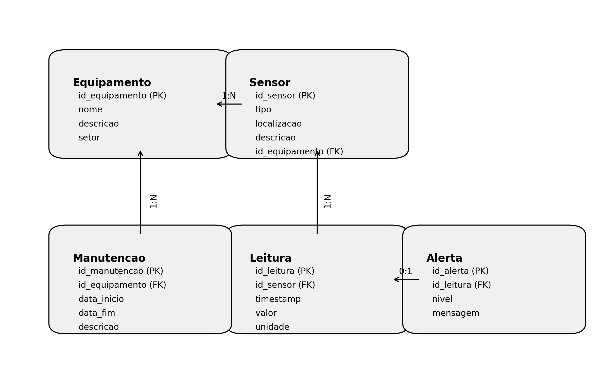

Hermes Reply – Sprint 3 (Fase 5)

Este repositório contém a solução para o desafio Hermes Reply (Fase 5) da FIAP. O objetivo é construir um sistema que integre um banco de dados relacional, um modelo de machine learning e uma documentação clara para monitorar sensores e manutenções em um ambiente industrial.

## Estrutura do repositório

- **db/** – Artefatos do banco de dados:
  - **der_textual.md** – descrição textual do modelo relacional, listando entidades, atributos e relacionamentos.
  - **script_postgres.sql** – script DDL para PostgreSQL com criação de tabelas, chaves primárias, estrangeiras e índices.

- **data/** – Conjunto de dados usado no modelo de machine learning:
  - **sensores.csv** – dataset simulado com 6 sensores e 500 leituras por sensor (3 000 linhas). Colunas: `id_sensor`, `temperatura`, `vibracao` e `estado`. O rótulo `estado` é definido por regras que combinam temperatura e vibração.

- **ml/** – Código e saías de machine learning:
  - **modelo_sensores.py** – script em Python (scikit‑learn) que gera o dataset, treina um classificador Random Forest, avalia o modelo e salva métricas e gráficos.
  - **metrics.txt** – arquivo com a acurácia e o relatório de classificação gerados pelo modelo.

- **docs/** – Visualizações geradas:
  - **matriz_confusao.png** – matriz de confusão das previsões.
  - **scatter.png** – gráfico de dispersão de temperatura versus vibração colorido pelo estado.

- **main.py** – ponto de entrada opcional.
- **requirements.txt** – dependências Python necessárias.

## Banco de dados

O modelo relacional compreende cinco entidades: **Equipamento**, **Sensor**, **Leitura**, **Manutencao** e **Alerta**. Cada equipamento possui vários sensores; sensores geram diversas leituras; uma leitura pode gerar nenhum ou um alerta; e equipamentos podem ter várias manutenções. As cardinalidades principais são 1:N (com exceção de Leitura–Alerta que é 0:1). O script SQL define as seguintes tabelas:

- **Equipamento** (`id_equipamento`, `nome`, `descricao`, `setor`)
- **Sensor** (`id_sensor`, `tipo`, `localizacao`, `descricao`, `id_equipamento`)
- **Leitura** (`id_leitura`, `id_sensor`, `timestamp`, `valor`, `unidade`)
- **Alerta** (`id_alerta`, `id_leitura`, `nivel`, `mensagem`)
- **Manutencao** (`id_manutencao`, `id_equipamento`, `data_inicio`, `data_fim`, `descricao`)

Chaves estrangeiras garantem a integridade referencial entre as tabelas. Índices adicionais são definidos em colunas consultadas com frequência, como 

### Diagrama ER

A modelagem do banco de dados resultou em um **Diagrama Entidade-Relacionamento (DER)** que ilustra as entidades e seus relacionamentos. O diagrama detalha as cinco entidades principais (Equipamento, Sensor, Leitura, Alerta e Manutencao) e suas chaves primárias e estrangeiras.



Este diagrama foi gerado com base no script SQL e facilita a visualização da estrutura relacional do banco de dados.
`tipo` de sensor e chaves estrangeiras.

## Modelo de machine learning

A tarefa de machine learning consiste em classificar o estado de operação de um sensor em **Normal**, **Alerta** ou **Crítico** a partir de medições de temperatura e vibração. Para isso, foi utilizado um **RandomForestClassifier** do Scikit‑learn, pois lida bem com limites não lineares e múltiplas classes.

O dataset é artificialmente gerado com distribuições normais em torno de valores típicos. As classes são definidas por regras simples:

- **Normal** – `temperatura < 75` e `vibracao < 6`
- **Alerta** – `75 ≤ temperatura < 90` ou `6 ≤ vibracao < 9`
- **Crítico** – `temperatura ≥ 90` ou `vibracao ≥ 9`

O script divide os dados em conjuntos de treino (80%) e teste (20%), treina o modelo e avalia a performance. A saída inclui a acurácia geral e um relatório de classificação (precisão, recall e F1‑score por classe), além de gráficos para a matriz de confusão e a distribuição dos dados.

## Como executar

1. Instale as dependências:

   ```bash
   python -m venv .venv
   source .venv/bin/activate  # No Windows: .venv\Scripts\activate
   pip install -r requirements.txt
   ```

2. Rode o script de machine learning:

   ```bash
   python ml/modelo_sensores.py
   ```

   Isso irá gerar (ou atualizar) o dataset em `data/sensores.csv`, treinar o modelo e salvar os resultados em `ml/metrics.txt` e os gráficos em `docs/`.

3. Crie o banco de dados:

   ```sql
   -- No psql
   \i db/script_postgres.sql
   ```

Esse projeto integra modelagem de dados e classificação automática para mostrar como sensoriamento industrial pode ser estruturado em um banco de dados e analisado por machine learning para auxiliar na manutenção e monitoramento de equipamentos.

## Leituras por sensor

O dataset `data/sensores.csv` contém 3 000 leituras (500 para cada um dos seis sensores). Abaixo, a contagem de leituras por `id_sensor`:

- Sensor 1: 500 leituras
- Sensor 2: 500 leituras
- Sensor 3: 500 leituras
- Sensor 4: 500 leituras
- Sensor 5: 500 leituras
- Sensor 6: 500 leituras

## Vídeo de apresentação

Inclua aqui o link para o vídeo (não listado no YouTube) com até 5 minutos explicando e justificando o projeto desta fase.
